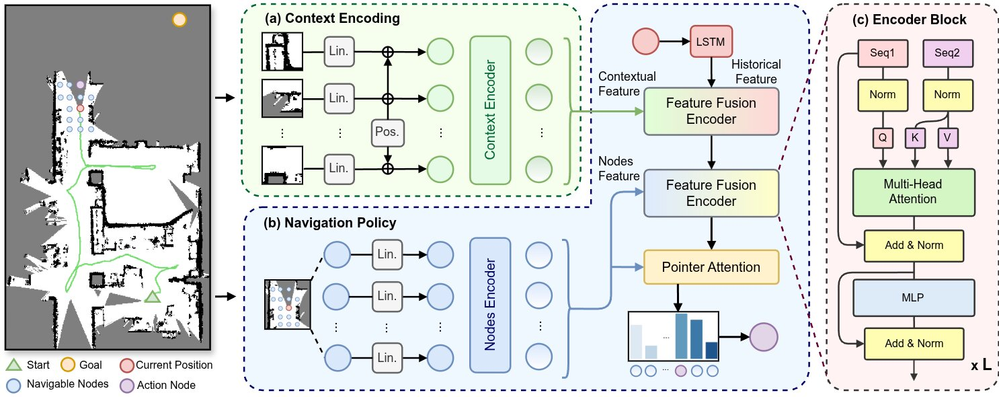
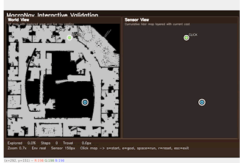
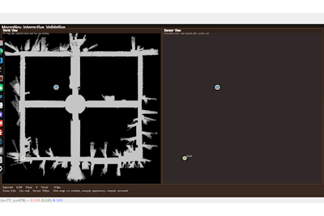

# MacroNav

Official code release for **MacroNav: Multi-Task Context Representation Learning Enables Efficient Navigation in Unknown Environments**.

MacroNav is a learning-based navigation framework for unknown environments. It first trains a lightweight context encoder with multi-task self-supervised learning, then integrates the learned dense contextual representation with an RL navigation policy.

<div align="center">
  
</div>

Demo video: [Bilibili](https://www.bilibili.com/video/BV175ofBTEpa/?share_source=copy_web&vd_source=31621f5011869655cf889054f5c4772c)

## Repository Structure

```text
MacroNav/
|-- dataset/
|   |-- GridMapV1/             # Encoder pre-training maps
|   `-- NavSimMapV1/           # Navigation simulation maps
|-- exps/
|   |-- pretrain/              # Pre-trained context encoder weights
|   `-- nav_policy/            # Policy checkpoints and validation outputs
|-- macronav/
|   |-- pretrain/              # Context encoder pre-training
|   `-- nav_policy/            # RL navigation policy training, validation, demo, export
|-- pyproject.toml
`-- README.md
```

## Installation

```bash
git clone https://github.com/SimonKennethRobo/MacroNav
cd MacroNav

conda create -n macronav python=3.10
conda activate macronav

pip install -e .
```

## Dataset Preparation

Download zip from [GoogleDrive](https://drive.google.com/file/d/1rEuVVzqzfjmvBkcMqM5Q4J7td7pToTW8/view?usp=sharing)

```bash
unzip macronav_dataset_and_ckpt.zip
```

After extraction, the expected paths are:

```text
dataset/GridMapV1
dataset/NavSimMapV1
exps
```

## Training

### 1. Context Encoder Pre-training

Edit `macronav/pretrain/config/train_param.py` if you want to change the experiment name, dataset path, batch size, or logging settings.

```bash
python macronav/pretrain/train_encoder.py
```

Outputs are saved under `exps/<EXP_NAME>/`, including checkpoints, copied config files, and logs.

### 2. Navigation Policy Training

Edit `macronav/nav_policy/config/train_param.py` if you want to change the experiment settings.

```bash
python macronav/nav_policy/train_nav.py
```

## Evaluation

Configure the target experiment in `macronav/nav_policy/config/valid_param.py`.

```bash
python macronav/nav_policy/valid_nav.py
```

### Interactive Demo

`valid_iter.py` provides an OpenCV-based interactive demo. It can run out of the box with the released maps and policy checkpoints after extraction.

The default dependency list installs `opencv-python-headless`, which is suitable for training and batch validation. For the interactive demo, install the GUI-enabled OpenCV package:

```bash

pip uninstall -y opencv-python-headless
pip install opencv-python

```

If you want to run ONNX policy inference in the interactive demo, install ONNX Runtime, refer [link](https://onnxruntime.ai/docs/install/#python-installs). Use the GPU package when CUDA is available:

First, check `macronav/nav_policy/config/valid_param.py`:

```python
LOG_DIR = "exps/nav_policy/<exp_name>"
ENV_LEVEL = "real"          # easy, medium, hard, or real
CUSTOM_MAP_IDX = 0 # set the map you want
```

Then run:

```bash
python macronav/nav_policy/valid_iter.py
```

Controls:

- Left click: select a point on the map
- `s`: set selected point as start
- `e`: set selected point as goal
- Space: start navigation
- `+` / `=`: zoom in
- `-`: zoom out
- `r`: reset
- `Esc`: exit

<div align="center">
  
  
</div>

## Model Export

Export a trained policy to ONNX, TensorRT, or both:

```bash
python macronav/nav_policy/scripts/export_policy.py \
  --checkpoint exps/nav_policy/<exp_name>/models/checkpoint_best.pth \
  --config exps/nav_policy/<exp_name>/train_param.py \
  --format both
```

For TensorRT export, install the matching CUDA/PyTorch/TensorRT packages for your system.

## Citation

```bibtex
@article{sima2026macronav,
  title={MacroNav: Multi-Task Context Representation Learning Enables Efficient Navigation in Unknown Environments},
  author={Sima, Kuankuan and Tang, Longbin and Yang, Zhenyu and Ma, Haozhe and Zhao, Lin},
  journal={IEEE Robotics and Automation Letters},
  year={2026},
  volume={11},
  number={6},
  pages={7636-7643}
}
```

## Acknowledgements

This codebase builds on ideas and components from the following open-source repositories:

- [Context_Aware_Navigation](https://github.com/marmotlab/Context_Aware_Navigation)
- [mae](https://github.com/facebookresearch/mae)

## License

This project is released under the MIT License. See [LICENSE](LICENSE) for details.
